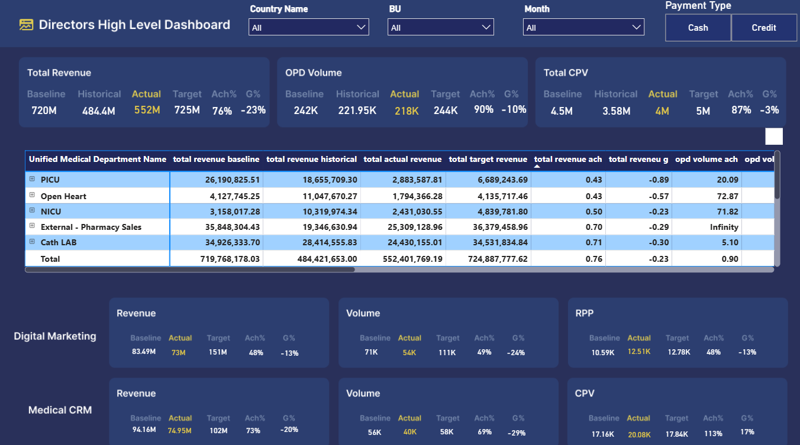

# 🏥 Directors High-Level Healthcare Dashboard - Power BI

## 📌 Project Overview
This executive dashboard provides a high-level performance overview for a **healthcare organization**, tracking revenue, volume, and operational efficiency across multiple medical departments. Built using **Power BI** with **Power Query** for data transformation, the dashboard enables directors to monitor actual performance against targets, identify underperforming areas, and make data-driven strategic decisions.

## 🖥️ Dashboard Preview

## 🎯 Objectives
- Monitor total revenue, OPD volume, and CPV (Cost Per Visit) against targets.
- Track achievement percentage (Ach%) and growth percentage (G%) for key metrics.
- Analyze departmental performance across PICU, Open Heart, NICU, Cath Lab, and Pharmacy.
- Enable dynamic filtering by country, business unit, month, and payment type.
- Provide actionable insights to improve revenue performance and operational efficiency.

## 🛠️ Tools Used
- **Power BI** – Dashboard design and interactive visualizations
- **Power Query** – Data extraction, cleaning, and transformation
- **DAX** – Custom measures for KPIs (Ach%, G%, variance analysis)
- **Figma** – Wireframing and dashboard prototype design

## 💡 Key Insights
- **Total Revenue** achieved **$552M** against a target of **$725M** (76% achievement), with a **-23% growth** decline from historical performance.
- **OPD Volume** reached **218K** against a target of **244K** (90% achievement), indicating relatively strong operational volume.
- **Total CPV** (Cost Per Visit) stands at **$4M** against a target of **$5M** (87% achievement), with only **-3% growth** decline.
- **External - Pharmacy Sales** shows the highest achievement at **70%**, while **PICU** lags behind at **43%**.
- **Medical CRM** shows **113% CPV achievement**, indicating higher cost efficiency than targeted.
- **Open Heart** department shows the highest actual revenue (**$11M**) compared to baseline, suggesting strong performance.

## 📋 Dashboard Features

### Key Performance Indicators (KPIs)
- **Total Revenue** – Actual, Target, Baseline, Historical
- **OPD Volume** – Actual vs Target
- **Total CPV** – Cost Per Visit metrics
- **Ach%** – Achievement percentage against target
- **G%** – Growth percentage vs historical

### Filters & Interactivity
- **Country Name** – Filter by country
- **BU** – Business Unit filter
- **Month** – Time-based filtering
- **Payment Type** – Cash / Credit toggle

### Visualizations
- **Cards** – High-level KPI summaries (Revenue, OPD Volume, CPV)
- **Matrix table** – Department-wise breakdown (Baseline, Actual, Target, Ach%, G%, OPD Vol, OPD Vol Ach%)
- **Bar charts** – Revenue and Volume performance by department
- **Gauge charts** – Achievement percentage visualization
- **Slicers** – Interactive filters for country, BU, month, and payment type
